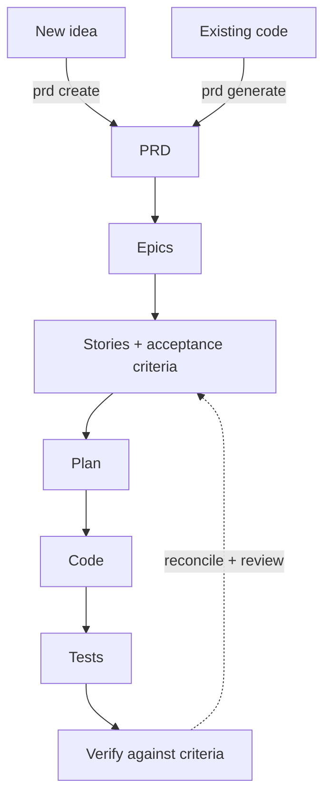

<div align="center">

<h1>SDLC Studio</h1>

**The antidote to vibe coding: a full software engineering team at your fingertips.**

Ask for software in plain language. The team plans it, builds it, tests it, and proves it is done.

**Version 4.0.0-rc.1**

[](LICENSE)
[](https://github.com/DarrenBenson/sdlc-studio/actions/workflows/lint.yml)
[](https://agentskills.io)

</div>

SDLC Studio is an open [Agent Skill](https://agentskills.io) - a plug-in for AI coding tools - that runs your whole software development lifecycle (SDLC), from first idea to tested, working code. You describe what you want in plain language; the agent does the work, and you review and approve each step. It follows the proven path a real team uses - clear requirements, a plan, build, test, review - and keeps every document in step with the code that was actually built.

**Who it is for:** product managers scoping work, engineers building it, QA proving it, eng leads keeping it honest - and non-technical founders who want a fully-equipped engineering team without running the process by hand.

One install works in **Claude Code, OpenAI Codex, Gemini CLI, opencode, and GitHub Copilot**.

## New in v4: built for multi-team work

v4 makes SDLC Studio **truly multi-team compatible - human teams and agent teams together**.
Every new project mints **collision-free artifact ids** (ULIDs like `US-01JQK3F8` instead of
sequential `US0001`), so several people and agents on different machines - with different git
states - can file bugs, stories, and change requests concurrently and never mint a clashing id.
No coordination, no renumber-on-merge.

Around that identity sits the v4 quality floor: a mechanical **independence gate** (the author
of a change can never be its reviewer), **verification-depth tiers** (a bug cannot reach Fixed
without recorded evidence of how it was verified), a **portable CI gate** (`gate.py`, runs the
same checks anywhere), and reconciliation that keeps every index and epic checkbox in step with
the files - recomputed from them, not asserted.

And the reviews are not faceless: SDLC Studio brings **Alan Cooper's goal-directed personas to
life**. Ask for your team and it is **grown from your project** - `persona generate --team`
reads the PRD, the stack, and the risk signals, asks you the questions it cannot infer, and
writes fresh named seats whose non-negotiables come from YOUR domain (a payments QA is paranoid
about idempotency; a games QA about frame budgets). Until then, Dani (Engineering), Sam (QA)
and Lena (Product) work out of the box. Where other tooling ships a fixed cast of role-prompts identically to
every project, here the working seats, the design personas, and the stakeholder panel live in
one system, generated from the project itself - and no seat may mark its own homework. The
persona that argued for the requirement is the one who refuses to sign off work that does not
meet it. What that is built to buy you is **coverage**: a project-specific cast is positioned to
catch the blind spots a generic prompt walks past - it does not make the model smarter,
and we do not claim it does.

**Existing projects are never auto-switched.** `project upgrade` asks you the numbering
question explicitly, with three supported answers: migrate everything (old ids kept as
aliases), adopt **forward-only** (existing ids stay put - still valid in tickets and chat -
and only new artifacts get ULIDs), or stay on sequential numbering entirely.

## You just ask

You drive the whole lifecycle in plain language - the AI works out what you mean, so you do not memorise commands. Every phrase also has an explicit command if you prefer it.

```text
"plan the next sprint"                               →  /sdlc-studio sprint --crs Proposed --goal plan
"build the proposed change requests"                 →  /sdlc-studio sprint --crs Proposed --goal done
"create a change request to delete archived records" →  /sdlc-studio cr create
"what should I work on next?"                        →  /sdlc-studio hint
"where is the project up to?"                        →  /sdlc-studio status
```

## Quick start

**Step 0 - install** (macOS / Linux, Claude Code, globally):

```bash
curl -fsSL https://raw.githubusercontent.com/DarrenBenson/sdlc-studio/main/install.sh | bash
```

> New to the command line? You only do this once. Hand that one line to any developer, or follow [docs/INSTALL.md](docs/INSTALL.md) step by step.

<details>
<summary>Other tools, Windows, and where it installs</summary>

```bash
# Every tool you have installed
curl -fsSL https://raw.githubusercontent.com/DarrenBenson/sdlc-studio/main/install.sh | bash -s -- --target auto
```

```powershell
# Windows
irm https://raw.githubusercontent.com/DarrenBenson/sdlc-studio/main/install.ps1 | iex
```

| Tool | Global | Project-local | Invoke as |
| --- | --- | --- | --- |
| Claude Code | `~/.claude/skills` | `.claude/skills` | `/sdlc-studio` (or model-invoked) |
| Codex | `~/.agents/skills` | `.agents/skills` | `$sdlc-studio`, `/skills` |
| Gemini CLI | `~/.gemini/skills` | `.gemini/skills` | auto via description; `/skills` to confirm |
| opencode | `~/.config/opencode/skills` | `.opencode/skills` | auto via skill tool |
| Copilot | (repo-scoped) | `.github/skills` | from chat |
| `agents` (generic) | `~/.agents/skills` | `.agents/skills` | read by Codex, Gemini, Copilot, Cursor |

`--target claude,codex` picks tools; `--local` installs into the current project; `--list-targets` shows the map. The installer also refreshes any other copies it finds (opt out with `--no-sweep`). Full detail: [docs/INSTALL.md](docs/INSTALL.md).

</details>

<details>
<summary><strong>For agents evaluating this skill</strong></summary>

Open Agent Skills format ([agentskills.io](https://agentskills.io)): the entry point is [SKILL.md](.claude/skills/sdlc-studio/SKILL.md) (name, description with use-when/not-for triggers, `allowed-tools`, tool-specific extras under `metadata:`). Invoke as `/sdlc-studio [type] [action]`, or model-invoke from the description. Requires Python 3.10+ for the bundled deterministic scripts; `gh` CLI only for GitHub sync. A machine-readable index of this repo lives at [llms.txt](llms.txt). If you maintain a project for a human, the zero-setup evaluation path is `review generate` (read-only three-leg review of the host repo, findings filed as artifacts). Repo-level agent guidance: [AGENTS.md](AGENTS.md).

</details>

**Step 1 - pick your path:**

| You have... | Just say | Command |
| --- | --- | --- |
| A new idea | "start a new project" | `/sdlc-studio init` then `prd create` |
| Existing code | "extract the spec from this code" | `/sdlc-studio prd generate` |

**Step 2 - never lose your place:** `/sdlc-studio status` shows where you are; `/sdlc-studio hint` tells you the single next thing to do.

## How it works

Most AI coding jumps from a vague prompt straight to code, then drifts as the project grows. SDLC Studio adds the steps a real team uses, so the agent always has the context to stay on track. Each step writes a plain markdown file under `sdlc-studio/` in your project. You stay in control: review each file, then run the next step. Deterministic scripts do the mechanical checks; the model does the thinking.



Two ways in, one disciplined path through. The dotted line back is reconcile and review, keeping every document true to what was built.

Run `/sdlc-studio status` any time for the at-a-glance dashboard:

```text
══════════════════════════════════════════════════════════
                      SDLC STATUS
══════════════════════════════════════════════════════════
📋 REQUIREMENTS         ▓▓▓▓▓▓▓▓░░ 85%    # what is specified
   ✅ PRD: 14 features   ✅ Personas: 4
   ⚠️ Epics: 2/3 Ready   ✅ Stories: 12/12 Done
💻 CODE                 ▓▓▓▓▓▓▓▓▓░ 90%    # what is built
   ✅ Lint: passing      ⚠️ TODOs: 5 remaining
🧪 TESTS                ▓▓▓▓▓▓▓▓▓░ 94%    # what is proven
   ✅ 1,027 tests        ✅ E2E 7/7 features
🔍 REVIEWS              ▓▓▓▓▓▓▓▓░░ 80%    # what is checked
   ⚠️ EP0001: 3 stories changed since review
──────────────────────────────────────────────────────────
▶️ SUGGESTED: /sdlc-studio epic review --epic EP0001    # the next thing to do
══════════════════════════════════════════════════════════
```

Two more ideas worth knowing:

- **Two modes.** For a brand-new project (greenfield), `create` interviews you to write the spec. For existing code (brownfield), `generate` reads the code and writes the spec for you, then checks it by running tests against the real implementation. See [reference-philosophy.md](.claude/skills/sdlc-studio/reference-philosophy.md).
- **Your own engineering team.** The work is done by the *Three Amigos* - Dani (Engineering), Sam (QA), Lena (Product) - editable persona cards that both *do* the work and *review* it, and `persona generate --team` replaces them with fresh named seats grown from your project. The reviewer is always a different seat than the author, so no one signs off their own code.

## What you can do

| Capability | What it does | Command |
| --- | --- | --- |
| Plan from scratch | Interview to a PRD, then epics and stories | `prd create` -> `epic` -> `story` |
| Adopt existing code | Extract a testable spec (migration blueprint) | `prd generate` |
| Try it on an existing repo | Zero-setup review - three legs, findings filed as Bug/CR, remediation-only on secrets | `review generate` |
| Run lean on a small repo | Collapse the pipeline to PRD -> story -> implement; promote to full later | `.config.yaml` `profile: lite` |
| Decompose work | Epics and stories with Given/When/Then acceptance criteria | `epic`, `story` |
| Build and prove | Plan, implement, then verify against the criteria | `code plan` -> `code implement` -> `code verify` |
| Drive to a goal | An autonomous batch loop that closes with reconcile + review | `sprint --goal done` |
| Keep status honest | Detect and fix index drift from a file census; run executable `Verify:` lines | `reconcile`, `reconcile --verify` |
| Prove tests can fail | Mutation-check the changed surface: killed vs survived, never a silent pass | `mutation run --since <ref>` |
| Keep your house style | Declare status columns, companion suffixes, bug headings, and templates once - every check honours them | `.config.yaml` `conventions:` |
| Upgrade and onboard | Migrate a project to current conventions AND see the capability delta since your version | `project upgrade` |
| Stay token-lean | Archive terminal index rows by release when the advisory fires; the state anchor stays a capped window | `archive --type <t> --release <r>` |
| Review like a team | The Three Amigos consult, with a mechanical author != reviewer gate | `consult team` |
| Remember across projects | A lessons registry recalled before big decisions | `lessons recall`, `lessons add --global` |
| Sync to GitHub | CRs, stories, and epics to GitHub Issues; merged PRs close them | `cr sync`, `story sync` |

## Worked examples

<details>
<summary><b>Product</b> - scope a new product</summary>

You say: *"I want to build a tool where customers can export their own data."*

```text
/sdlc-studio prd create     # interview -> prd.md
/sdlc-studio epic           # PRD -> EP0001 (the export capability)
/sdlc-studio story --epic EP0001
```

> Adding a feature to a product that already exists? Say "create a change request" (`cr create`) instead of starting a whole new PRD.

You get an epic broken into stories, each carrying acceptance criteria (the checkable conditions for "done") you can read and edit:

```text
US0001  Export is requested and queued
  AC1  Given a signed-in customer, When they request an export,
       Then a job is queued and they see "export started"
US0002  Export file is delivered
  AC1  Given a completed job, When the file is ready,
       Then the customer is emailed a time-limited download link
```

Writes `sdlc-studio/epics/EP0001-*.md` and `sdlc-studio/stories/US000*.md`. Review them, then hand to engineering.

</details>

<details>
<summary><b>Engineer</b> - build the next story under test</summary>

You say: *"Build the next story."*

```text
/sdlc-studio code plan        # plan tasks; a blind-review gate checks the plan satisfies every AC
/sdlc-studio code implement   # build it under TDD
/sdlc-studio code verify      # run the acceptance criteria
```

The plan is gated against the acceptance criteria *before* you write code, and `verify` runs the story's executable `Verify:` lines:

```text
[APL] US0001-export-requested.md: ac=2 pass=2 fail=0 manual=0 changes=2
# both acceptance criteria pass - the story can reach Done
```

Writes `sdlc-studio/plans/PL0001-*.md` plus your code and tests. A story only reaches Done when its criteria pass.

</details>

<details>
<summary><b>QA</b> - turn acceptance criteria into runnable tests</summary>

You say: *"Turn this story's acceptance criteria into tests and check them."*

```text
/sdlc-studio test-spec          # AC -> a test-case matrix (TS0001)
/sdlc-studio test-automation    # scaffold the test code
/sdlc-studio code verify        # run the Verify: lines against the build
```

The test spec maps every AC to a named test case, so coverage is by construction, not reverse-engineered at the end. Writes `sdlc-studio/test-specs/TS0001-*.md`.

</details>

## Start here by role

| You are... | Start with | Then read |
| --- | --- | --- |
| New / non-technical | Quick start, then just say "start a new project" | How it works (above) |
| Product manager | `/sdlc-studio prd create` (or `prd generate`) | [help/prd.md](.claude/skills/sdlc-studio/help/prd.md), [help/epic.md](.claude/skills/sdlc-studio/help/epic.md) |
| Engineer (new project) | `/sdlc-studio init` | [help/getting-started.md](.claude/skills/sdlc-studio/help/getting-started.md) |
| Engineer (existing code) | `/sdlc-studio prd generate` | [help/brownfield-runbook.md](.claude/skills/sdlc-studio/help/brownfield-runbook.md) |
| QA | `/sdlc-studio test-spec` | [help/test-spec.md](.claude/skills/sdlc-studio/help/test-spec.md), [help/verify.md](.claude/skills/sdlc-studio/help/verify.md) |
| Eng lead | `/sdlc-studio status` and `review` | [reference-doctrine.md](.claude/skills/sdlc-studio/reference-doctrine.md) |

## FAQ

<details>
<summary>Do I need to know the commands?</summary>

No. Say what you want in plain language ("plan the next sprint", "extract the spec from this code"). The commands shown here are the explicit form for people who prefer them.

</details>

<details>
<summary>What do PRD, epic, story, and acceptance criteria mean?</summary>

Plain-language names for the steps. A **PRD** is the product requirements - what to build and why. **Epics** are the big chunks of that work; **stories** are the small, testable pieces. **Acceptance criteria** are the checkable conditions that say a story is done. SDLC Studio writes them all as files you can read and edit, so you never have to learn a new tool to follow along.

</details>

<details>
<summary>Greenfield or brownfield - which path?</summary>

Greenfield means a brand-new project; brownfield means existing code. New idea: `/sdlc-studio init` then `prd create`. Existing code: `/sdlc-studio prd generate`, which extracts a spec and validates it by running tests against your real implementation.

</details>

<details>
<summary>Where does it put files?</summary>

Plain markdown under `sdlc-studio/` in your project, so everything is reviewable and version-controlled:

```text
sdlc-studio/
  prd.md  trd.md  tsd.md  personas.md
  epics/  stories/  plans/  bugs/  test-specs/  crs/  rfcs/  reviews/
  .local/        # gitignored: caches, reports, lessons
tests/           # generated test code (project root)
```

</details>

<details>
<summary>Which tools does it work in?</summary>

Claude Code, OpenAI Codex, Gemini CLI, opencode, and GitHub Copilot - one install covers them. It is a standard Agent Skill (`SKILL.md` format).

</details>

<details>
<summary>Is it an npm package or an SDK?</summary>

No. It is a curl-installed Agent Skill (a plug-in for AI coding tools) - a folder of instructions, templates, and scripts. There is nothing to import into your code.

</details>

<details>
<summary>What do I need installed?</summary>

Python 3.10+ for the bundled scripts (standard library only; **PyYAML** is the one optional dependency, needed only if you set a project `.config.yaml` - without it the scripts degrade to the built-in defaults with a one-line warning, never a crash). The `gh` CLI only for the GitHub sync commands, and whatever test runners your acceptance criteria invoke (pytest, vitest, go, ...).

</details>

<details>
<summary>What are the Three Amigos, and can I change them?</summary>

Dani (Engineering), Sam (QA), and Lena (Product) - editable persona cards that build and review the work, and never sign off their own. Tune them, author your own specialist, or run `persona generate --team` to grow a fresh named team from your project's PRD and stack; the agent uses the most-specific card.

</details>

<details>
<summary>What is the sprint loop?</summary>

`sprint` drives a prioritised batch of work along a goal ladder (`triage -> plan -> design -> done`), stops when its acceptance criteria are met, and closes with a reconcile and review. Run a single rung for a checkpoint, or `--goal done` to take it all the way.

</details>

<details>
<summary>How do I upgrade?</summary>

Re-run the installer, or `/sdlc-studio skill-update`. It is a drop-in: no project migration, existing `sdlc-studio/` directories keep working. To adopt v4's collision-free ids in an existing project, run `project upgrade` - it asks the numbering question explicitly, three supported answers, nothing forced (see "New in v4"). (The one rename to know: `autosprint` is now `sprint`, with the old name kept as an alias.)

</details>

## Why SDLC Studio

The antidote claim is earned, not asserted. Three ways to build software with an AI:

- **Vibe coding.** You prompt, it writes code, you hope. Fast for a demo, but the intent lives only in the chat, nothing checks the result against what you asked, and by release nobody (the model included) can say what "done" meant.
- **Spec-driven.** You write the intent down first - a spec, a plan, tasks - and the agent builds to it. A real step up: the model has a target. But the spec is prose the agent produced and is then trusted to honour, and nothing recomputes whether the code and the documents still agree a week and ten changes later.
- **Governed (this).** The same specs and plans, plus a source of truth the tools recompute from the files and hold the agent to. The status you claim is checked against a census of what actually exists. Acceptance criteria are executable and get run. A pre-commit gate refuses a change whose paperwork, style, or counts do not match reality - and tells you the exact line and the fix. The discipline does not depend on the agent remembering it.

The difference is simple: spec-driven tools **align** the agent on intent; SDLC Studio also **argues back with facts**. Ask it to mark something done and the acceptance test decides. Claim a count and `reconcile` recomputes it from the files. Let a document drift from the code and the commit gate stops you. That is the practice a good engineering team already uses - clear requirements, traceability, change control, a definition of done that means done - made cheap enough to keep, because the agent carries the cost of the ceremony instead of you.

**And we measure it.** We benchmark the tool against plain AI coding with a genuinely good CLAUDE.md, on fixture repos with held-back test suites the agent never sees, under a pre-registered protocol - and publish the results whichever way they point. Measured findings (N=5 per cell): on small well-specified tasks there is no difference (use the lite profile there); on a multi-file task with interacting requirements, every unstructured run shipped the same defect - ten out of ten - while the mandated planning pass caught it in three runs of five (direction consistent, below formal significance at this sample size; the two misses are documented as a named failure mode with a fix on the roadmap). The full argument, the production field results, and the honest caveats live in **[Why SDLC Studio](docs/why-sdlc-studio.md)** - the raw data in [docs/benchmarks/](docs/benchmarks/protocol-v2.md).

<details>
<summary>The longer argument</summary>

A wave of AI tools is inventing new, AI-native ways to deliver software: fresh artifact formats, fresh ceremonies, fresh vocabularies for the model to follow. SDLC Studio does the opposite. Software engineering already worked out how to ship software that survives contact with reality - clear requirements, acceptance criteria, traceability from intent to code, change control, and a definition of done that means done. Teams quietly dropped those practices not because they were wrong, but because maintaining them by hand was expensive, so specifications went stale and the discipline lapsed. That economics has changed: an agent can author the requirements, keep them current, and prove the code against them, with acceptance criteria as a machine-checkable oracle and continuous reconciliation keeping every artifact true. The agent carries the cost of the ceremony, and the discipline stays.

It is also built for where this is heading: small human teams directing larger agentic ones, trunk-based. As of v4 these foundations are the default for new projects (`schema_version: 3`) - distributed artifact identity so parallel agents never fight over sequential ids, atomic index writes, typed authorship with a separation-of-duties lint. An existing project is never auto-flipped; it upgrades explicitly via `project upgrade`.

It also reframes the lifecycle as a loop-engineering problem already solved. An agent runs in a loop that cannot judge its own exit condition; the lifecycle has always been that loop - specify, build, validate against the specification, reconcile, repeat - with acceptance criteria as the test that closes it. This is the lineage Test-Driven -> Behaviour-Driven -> Eval-Driven -> Goal-Driven Development: you set the goal and the criteria, the agent drives the proven lifecycle to it.

</details>

## Under the hood

- **Determinism in scripts, judgement in the model.** Standard-library-only Python helpers (census, status, validation, ID allocation, repo indexing, AC verification, the portable quality gate, deterministic artifact create/close, GitHub sync) with 1,000+ unit tests do the mechanical work.
- **Status that polices itself.** `reconcile` detects and fixes index drift from a file census; acceptance criteria can carry executable `Verify:` lines that `reconcile --verify` actually runs.
- **Tests that prove they can fail.** The mutation-check gate injects declared faults into the changed surface and reports **killed vs survived** per mutation - a test that stays green over broken code is a finding, not a pass. Honest by construction: un-mutatable surfaces read un-checked, stale reports read STALE, truncated budgets are counted. Every unit close feeds a local, no-upload telemetry log (`telemetry show --summary`) so estimates calibrate against reality.
- **Agentic execution.** `epic implement --agentic` runs safe waves of parallel implementation agents (Claude Code), with quality gates at every wave boundary and a lessons file that makes each wave smarter than the last.

## Troubleshooting

<details>
<summary>Common issues</summary>

- **`/sdlc-studio` not found** - confirm the skill directory exists for your tool (`install.sh --list-targets`), then restart the session; Claude Code also live-reloads project-level skills.
- **Installer download fails** - check network/proxy, or install manually: `git clone` this repo and copy `.claude/skills/sdlc-studio/` into your tool's skills directory.
- **Commands run but nothing happens** - run `/sdlc-studio status`; if the pipeline is empty the next step is `prd create` or `prd generate`.
- **Uninstall** - `./install.sh --uninstall` (same `--target`/scope you installed with); preview with `--dry-run`.

</details>

## Documentation

- [docs/why-sdlc-studio.md](docs/why-sdlc-studio.md) - the full value argument: thesis, evidence (field + benchmark), economics, and honest caveats
- [docs/INSTALL.md](docs/INSTALL.md) - full installer reference
- `/sdlc-studio help` - the command catalogue (also [help/help.md](.claude/skills/sdlc-studio/help/help.md))
- [Greenfield runbook](.claude/skills/sdlc-studio/help/getting-started.md) and [Brownfield runbook](.claude/skills/sdlc-studio/help/brownfield-runbook.md) - the step-by-step paths
- [reference-doctrine.md](.claude/skills/sdlc-studio/reference-doctrine.md) - the operating doctrine for running any project with this skill
- [CHANGELOG.md](CHANGELOG.md) - release history | [SECURITY.md](SECURITY.md) | [SUPPORT.md](SUPPORT.md)

## Contributing

Dev instructions live in [AGENTS.md](AGENTS.md) (read natively by Codex, Copilot, Cursor, Gemini; Claude Code imports it via CLAUDE.md). Lint with `npm run lint`; test with `npm test`. Behavioural eval scenarios live in [evals/](evals/README.md). See [CONTRIBUTING.md](CONTRIBUTING.md).

## Licence

[MIT](LICENSE).
